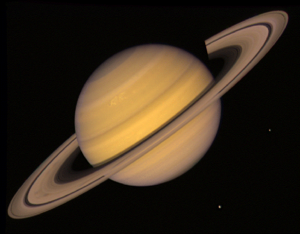

# NASA Raumsonden
### Pioneer, Voyager, New Horizons

## Pioneer

### Fakten
- bla

<!-- .slide: data-background-iframe="http://spacecrafts3d.org/models/pioneer.html" data-background-interactive-->

## Voyager

Note:
Planetenkonstellation perfekt um Schwung an jedem Pleneten zu holen
nur alle 176 Jahre
Voy 2 startet zuerst, wird aber später von Voy 1 überholt sodass die reihenfolge stimmt

## Wissenschaftliche Erkenntnisse
<!-- .slide: data-background-video="pictures/jupiter.mp4" data-backround-video-loop data-background-video-muted -->

## Jupiter
 <!-- .element: class="stretch" -->
Note:
Erste Beobachtung vulkanischer aktivität außerhalb der Erde

## Saturn
 <!-- .element: class="stretch" -->
Note:
Hauptsächlich relativ langweilige Informationen über die Atmosphäre, Bewegungen, etc. deshalb lieber Bild

## "Pale Blue Dot"
 <!-- .element: class="stretch" -->
Note:
6 Millarden km entfernt sieht man die Erde nur noch als einen kleinen Punkt
TODO: vergrößerte Aufnahme zeigen

<!-- .slide: data-background-iframe="http://spacecrafts3d.org/models/voyager.html" data-background-interactive-->
Note:
ungefähr so groß wie ein Bus
Thermoelektrischer Generator (von Plutonium-238-oxid betrieben)
Parabolantenne
insgesamt 11 Instrumente:
	Magnetometer (hauptsächlich um zu erkennen ob man sich noch in der Heliosphäre befindet)
	(Schwarzweiß) Kameras (für mehr Auflösung), Spektrometer, Radioastronomie
	Kalibrierplatte
Goldene Schallplatte

## Goldene Schallplatte
<!-- .slide: data-background-image="pictures/tworecords.png" -->
Note:
Besondere Aufmerksamkeit der Medien
Team hatte nur 6 Wochen Zeit
1.5h Musik von unterschiedlichen Kulturen, Grüße in 55 Sprachen, Geräusche von der Erde, Bilder
Symbole auf der Platte erklären Nutzung und Herkunft
Tonnehmer beigelegt

## New Horizon
Note:
Pluto nahezu unerforscht, da knapp 6 Mrd km entfernt

Note:
Bild vom Hubble Space Telescope, einem der besten Teleskope
Problem: große Entfernung, sehr klein, sogar kleiner als Erdmond
kein Planet sondern Zwergplanet, größtes Objekt im Kuiper Gürtel, entstand in der Jugend des Sonnensystems, deshalb für Wissenschaft sehr interessant

<!-- .slide: data-background-iframe="https://solarsystem.nasa.gov/gltf_embed/2363/?fs=true" data-background-interactive-->
 <!-- .element: style="height:30%" -->
Note:
2003 auf Drängen von "Pluto Underground" (Gruppe von jungen Wissenschaftlern mit Interesse an Pluto) Beginn des Baus
Ziel: <10Jahre bis Erreichen von pluto --> schnellstes Raumschiff (16.26 km/s)
-> muss sehr leicht sein, nur so groß wie ein Piano und 478 kg
durch vorbeifliegen an Jupiter Geschwindigkeitserhöhung um 20%, Verkürzung der Flugzeit um 3 Jahre

Note:
nach einem perfekten Start und ca. 9,5 jähriger Reise (auf der es keine aufgaben gibt) ist die Sonde 9 Tage von Pluto entfernt, plötzlich bricht die Kommunikation ab

## Quellen
- [spacecrafts3d.org](https://spacecrafts3d.org)
- Dokumentation "The Farthest"

## Bild- und Videoquellen
- [web.mit.edu](http://web.mit.edu/lilybui/Public/tworecords.png) 
- [youtube.com](https://www.youtube.com/watch?v=9nf9nBtd2dM) 
- [nasa.gov](https://voyager.jpl.nasa.gov/galleries/images-voyager-took/)
